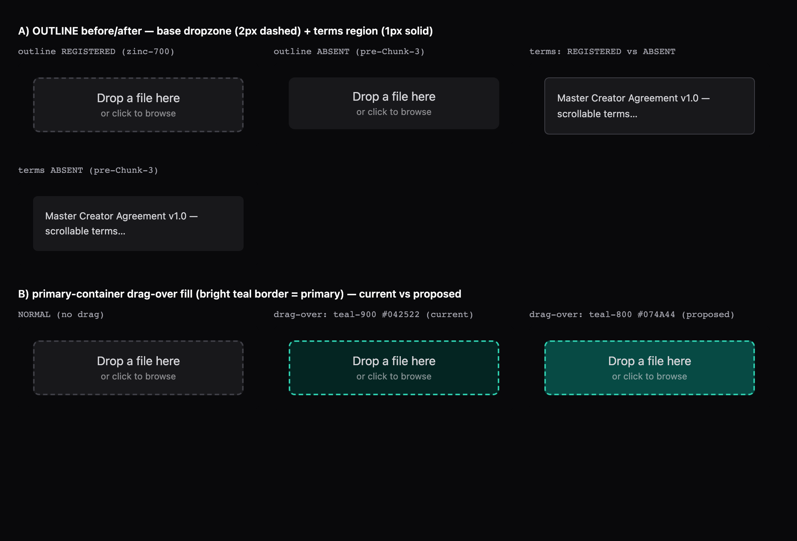

# Sprint 3.5 — Chunk 3 Review

**Status:** Closed. Spot-check approved with one pre-commit correction (PMC-1: dark `primary-container` teal-900 → teal-800, eyes-on verified) + one cheap verification (empirical outline before/after captured in headless Chromium). Everything else approved. The work is mergeable as-is.

**Reviewer:** independent review + spot-check pass (2026-05-31). Implementation drafted by Cursor.

**Reviewed against:** `PROJECT-WORKFLOW.md` § 3 (chunk lifecycle) + § 5 standards (5.1 source-inspection tests, #40 break-revert defence-in-depth, #34 cross-chunk handoff, pause-condition discipline) + § 6 (sub-chunk planning), `02-CONVENTIONS.md` § 3.8 (token-first styling), `docs/reviews/sprint-3-5-chunk-1-review.md` (inheritance contracts 1–4) + `docs/reviews/sprint-3-5-chunk-2-review.md` (inheritance contracts 5–8 + the three inherited findings), the Sprint 3.5 Chunk 3 kickoff + the plan-approval message (§5b expanded to 4 tokens; values locked; sub-step grouping approved).

This is the **verification chunk** of the Engine C v2 visual-layer refresh: a surface-by-surface visual-regression sweep across both SPAs in light and dark mode, verifying the v2 token layer renders cleanly, resolving the three findings inherited from Chunk 2, and tokenizing the obvious structural literal that the read pass surfaced. It is deliberately decision-light and fix-conservative — drift gets fixed inline; polish is logged, not chased.

---

## Scope — three code-change sub-steps + a six-family eyes-on sweep

The chunk splits into **code changes** (inherited findings + one tokenization) and a **verification sweep** (source-level pass + collaborative eyes-on). Each code sub-step is independently green.

1. **Inherited finding (a) — `CEmptyState` `h1→h3` heading skip.** Added a `titleTag?: 'h2' | 'h3' | 'h4'` prop to `CEmptyState` (default `'h3'`, preserving every existing call site) rendering the title via `<component :is="titleTag">`. Applied `title-tag="h2"` to both `CEmptyState` instances on `BrandListPage` (under the page `<h1>`), closing the heading-level skip. Spec extended for the `h2` / `h4` overrides + the `h3` default.
2. **Inherited finding (b) — register the Material container/variant tokens (3 → 4, §5b expansion).** Registered explicit per-mode values for `outline`, `outline-variant`, `primary-container`, and `error-container` in both `lightTheme` and `darkTheme`, plus a **7th `color-system-parity` invariant** (both SPAs) that registers each slot and pins its per-mode value. The kickoff named three tokens; the read pass found a **fourth that was a latent rendering bug** (`outline` — see the pause-condition note below), so §5b expanded to four with the values locked at plan-approval.
3. **§5d — tokenize `OnboardingLayout` `border-radius: 8px` → `var(--radius-lg)`.** Surgical, exact-match-only: `8px` is the exact `--radius-lg` scale step. Other hardcoded structural literals encountered in the sweep were logged but **not** swept (not exact-scale matches, or outside the chunk's conservative remit).
   4–9. **Visual-regression sweep — six surface families.** Source-level token-flow verification of every user-facing surface, then a collaborative eyes-on pass (both SPAs, light + dark):
   - **Family 1 — Auth flows.** Fixed a stale `AuthLayout` doc-comment that still described the dropped `prefers-color-scheme` system-default behaviour (Chunk 1 removed it). Comment-only; no behaviour change.
   - **Family 2 — Onboarding wizard (creator).** High-CSS cluster; verified token-driven re-theme.
   - **Family 3 — Agency shell** (brands, agency-users, bulk-invite phases, settings, `AgencyLayout` chrome).
   - **Family 4 — Creator surface** (dashboard states + layout).
   - **Family 5 — Admin surfaces** (`CreatorDetailPage` + dialogs + `PlaceholderPage` + chrome).
   - **Family 6 — Dialogs / overlays** + the dense-list **14px verdict** (inherited finding (c)).
4. **Verification + tech-debt + this review.** Full suites both SPAs + design-tokens, typecheck, lint, dual builds; fresh break-revert on the new 7th invariant; one new tech-debt entry (harness theme gap).

---

## §5b 3 → 4 tokens — the pause-condition that caught a latent bug

The kickoff scoped finding (b) to **three** container tokens (`primary-container`, `outline-variant`, `error-container`). During the read pass, `--v-theme-outline` was found referenced in two consumption shapes — **raw** (`rgb(var(--v-theme-outline))`, no fallback) on the avatar + portfolio dropzone dashed borders and the click-through terms region, and **fallback-chained** (`rgb(var(--v-theme-outline-variant, var(--v-theme-outline)))`) on the Step 2 / Step 3 / Step 9 boxes, `EditFieldRow`, and the portfolio item border. **Neither `outline` nor `outline-variant` was a registered theme slot, and — verified against Vuetify 3.12.5's `genDefaults()` (`composables/theme.js`) — neither exists in Vuetify's default theme either**, so our themes (which `mergeDeep` over the defaults) emitted no `--v-theme-outline` or `--v-theme-outline-variant` CSS variable.

The consequence is sharper than "wrong colour": an undefined custom property inside `rgb()` makes that `rgb()` invalid, which makes the whole `border` **shorthand** _invalid at computed-value time_, so every border longhand resets to its initial — including `border-style: none`. **The border did not render at all.** And because the fallback chain's fallback target (`--v-theme-outline`) was _itself_ undefined, the fallback-chained surfaces were broken too — not just the three raw ones. This is a **latent bug inherited from before Chunk 3**; it is the concrete failure mode behind Chunk 2's logged-for-Chunk-3 "container/variant tokens not explicitly registered" follow-up.

Per the chunk's **Pause Condition #2** (a finding materially changes the planned scope), implementation paused and the plan was adjusted to register **four** tokens, with `outline` carrying a real per-mode value. The four values were locked at plan-approval:

| slot                | light                | dark                                          |
| ------------------- | -------------------- | --------------------------------------------- |
| `outline`           | zinc-300 `#D4D4D8`   | zinc-700 `#3F3F46`                            |
| `outline-variant`   | zinc-200 `#E4E4E7`   | zinc-800 `#27272A`                            |
| `primary-container` | teal-50 `#E6F8F5`    | teal-800 `#074A44` (spot-check fix; see note) |
| `error-container`   | danger-100 `#FEE2E2` | `#3B1A1A` (see note)                          |

**Before:** `--v-theme-outline` / `--v-theme-outline-variant` undefined → `rgb(var(...))` invalid → border shorthand invalid-at-computed-value-time → `border-style: none` → **no border on the dropzones, the click-through region, and the Step 2/3/9 + `EditFieldRow` + portfolio-item boxes.** **After:** both slots registered → the vars emit → all those borders render their intended subtle outline in both modes.

**Empirical before/after (observed, not just analytical).** During the spot-check return trip the exact dropzone + terms-region CSS (copied verbatim from `AvatarUploadDrop` / `ClickThroughAccept`) was rendered in **headless Chromium** under the exact Vuetify-emitted dark-theme variables — once with `outline*` registered, once with the vars omitted (the pre-Chunk-3 state). Result, top row of the artifact below: with the vars **absent**, the dropzone dashed border and the terms-region solid border **disappear entirely** (border-style resets to `none`); with them **registered**, both render. This converts the analytical claim to an observed one.

---

## Inherited findings (Chunk 2) — all three resolved

- **(a) `CEmptyState` h1→h3 heading skip** — **fixed.** `titleTag` prop; `BrandListPage` empty states now render `<h2>` under the page `<h1>`. Default stays `h3` so the other four Chunk-2 call sites are unchanged.
- **(b) `-container` / `-variant` Material tokens not explicitly registered** — **fixed.** Four tokens registered per-mode in both themes + a 7th parity invariant; the `outline` latent bug fixed as part of the expansion.
- **(c) dense-list 14px readability** — **verdict: keep 14px.** Eyes-on across `CountryDisplay`, `SocialAccountList`, `LanguageList`, `PortfolioGallery` confirmed the uniform `body` (14px) reads cleanly and is not cramped on the zinc dark surface. This closes the Chunk-2 R3 follow-up: no migration to `body-lg` (16px), no scattered allowlist exceptions. The 15px scale gap stays a documented characteristic of the chosen 12-step scale.

---

## Honest deviations & notes

- **`error-container` dark is a hand-picked literal (`#3B1A1A`), not a scale step.** The `danger` palette has no clean dark container step; `#3B1A1A` is a muted dark-error surface. Its only consumer today is `PortfolioGallery`'s remove-button **`:focus-visible`** background (raw `rgb(var(--v-theme-error-container))` + `rgb(var(--v-theme-on-error-container))`). Before Chunk 3 both were undefined → the focus background declaration was invalid and the text colour inherited; after registration, the background renders and **`on-error-container` auto-derives to white** (Vuetify `genOnColors` → `getForeground(#3B1A1A)`, since the surface is dark) at ~14:1 — so that surface is fully fixed even though only `error-container` was hand-set. The `vuetify.ts` inline comment rationalises the value via a zinc-300-on-surface ~13:1 figure; the live foreground is the auto-derived white, which is comparable/better. The parity invariant pins the `error-container` value so it can't drift silently.
- **`primary-container` dark was downgraded teal-900 → teal-800 (`#074A44`) at spot-check (PMC-1), eyes-on verified.** It is consumed only as the **drag-over** background of the two dropzones (`AvatarUploadDrop` / `PortfolioUploadGrid`, both with a `var(--v-theme-surface-variant)` fallback — so unlike `outline`, this one was never _broken_, just falling back). The originally-locked teal-900 (`#042522`) measured only ~**1.09:1** against the zinc-900 surface — an invisible wash. The reviewer correctly flagged that pinning it would regression-lock a non-functional fill (worse than not registering, since finding (b)'s purpose is _precise_ dark control). Fixed to **teal-800 (`#074A44`, ~1.75:1)**: rendered in headless Chromium (bottom row of the artifact above), teal-800 reads as a **distinct** drag-over fill **and** stays clearly subordinate to the bright teal-400 `primary` border (the dominant affordance) — whereas teal-900 was indistinguishable from the normal surface. The parity test's pinned dark value was updated to `#074a44` to match. Light-mode `primary-container` (teal-50 `#E6F8F5`) is unchanged — it reads fine on the light surface.
- **The component-test harness renders under Vuetify's stock light theme, not the Catalyst themes.** This is why the sweep had to be eyes-on rather than asserted — there is no automated dark-mode rendering coverage. The token VALUES are regression-locked (`color-system-parity`), and `no-hard-coded-colors` / `no-inline-color-styles` guard the common drift sources, but nothing renders a component against the dark theme. Logged as tech-debt (below); the resolution is to register the themes in the harness and add targeted dark-mode rendering specs.
- **`AuthLayout` change is comment-only.** A stale doc-comment described the dropped `prefers-color-scheme` system default; corrected to describe the current binary dark-first behaviour. No code path changed.
- **Other hardcoded structural literals were logged, not swept.** §5d is exact-match-only — only the `OnboardingLayout` `8px` (an exact `--radius-lg`) was tokenized. Non-exact literals stay as-is this chunk to keep the verification chunk conservative.
- **A functional wizard bug was found during the eyes-on sweep and fixed in a SEPARATE commit** — see the cross-chunk note. It is not part of Chunk 3's scope or commit.

---

## Acceptance criteria

| #   | Criterion                                                         | Status                                                                                        |
| --- | ----------------------------------------------------------------- | --------------------------------------------------------------------------------------------- |
| 1   | v2 token layer verified rendering across all surfaces, both modes | ✅ source-level pass + collaborative eyes-on (both SPAs, light + dark); Pedram verdict: clean |
| 2   | Inherited finding (a) — heading skip resolved                     | ✅ `titleTag` prop + `BrandListPage` h2; spec covers h2/h3/h4                                 |
| 3   | Inherited finding (b) — container/variant tokens registered       | ✅ 4 tokens both themes (3→4, latent `outline` bug fixed); 7th parity invariant (both SPAs)   |
| 4   | Inherited finding (c) — dense-list 14px verdict                   | ✅ keep 14px (eyes-on confirmed); closes Chunk-2 R3 follow-up                                 |
| 5   | Obvious structural literals tokenized                             | ✅ `OnboardingLayout` `8px` → `var(--radius-lg)`; non-exact literals logged, not swept        |
| 6   | Architecture-test surface extended                                | ✅ 7th `color-system-parity` invariant (container/variant), both SPAs; break-revert verified  |
| 7   | All existing tests green                                          | ✅ main 612, admin 303, design-tokens 22 (+1 todo)                                            |
| 8   | Inheritance contracts (Chunks 1 + 2) respected                    | ✅ see below                                                                                  |

---

## Inheritance contracts — all respected

**Chunk 1 (1–4):**

- **Aurora utility-only** — untouched; the four new tokens are zinc/teal/danger derived, no aurora hex enters `theme.colors`. Parity invariant 3 still passes.
- **Semantic-chip foregrounds on warm `neutral`** — untouched.
- **`<meta theme-color>` + `<html data-theme>`** — untouched in both `index.html`.
- **`matchMedia` one-way ratchet** — untouched; the `AuthLayout` comment fix documents the dropped system default rather than re-introducing it.

**Chunk 2 (5–8):**

- **Defaults block is the styling SOT** — honored; the radius tokenization consumes `var(--radius-lg)`, no inline style added.
- **`--catalyst-typography-*` canonical path** — untouched.
- **Radius scale is `--radius-*`** — `OnboardingLayout` now consumes `var(--radius-lg)`.
- **`CEmptyState` is the empty-state scaffold** — extended (additive `titleTag` prop), not replaced; all Chunk-2 call sites unchanged.

---

## Verification results

| Gate                                    | Result                                                                                                                                     |
| --------------------------------------- | ------------------------------------------------------------------------------------------------------------------------------------------ |
| `packages/design-tokens` Vitest         | **22 / 22** (+1 todo) — unchanged                                                                                                          |
| `apps/main` Vitest                      | **612 / 612** (65 files) — was 598 at Chunk-2 close (+14: +10 Chunk 3, +4 the separate wizard fix)                                         |
| `apps/admin` Vitest                     | **303 / 303** (31 files) — was 295 at Chunk-2 close (+8, all Chunk 3 parity invariant)                                                     |
| `pnpm typecheck:frontend`               | 0 errors (all 5 workspaces)                                                                                                                |
| `pnpm lint:frontend`                    | 0 errors (2 pre-existing `v-html` warnings, unrelated)                                                                                     |
| `pnpm --filter @catalyst/main build`    | clean (7.17s)                                                                                                                              |
| `pnpm --filter @catalyst/admin build`   | clean (4.38s)                                                                                                                              |
| **Break-revert — 7th parity invariant** | dark `outline-variant` `zinc[800]` → `zinc[700]` → the per-mode "outline-variant" pin failed (1 failed / 38 passed) → reverted → 39 passed |

**Test-count attribution.** Chunk 3 proper adds **+10 main** (7th parity invariant = 8 cases + `CEmptyState` titleTag = 2) and **+8 admin** (7th parity invariant = 8 cases). The remaining **+4 main** in the suite total are the separately-committed wizard fix (Tax 3 + Contract 1) — counted here only because the suite is shared; they are not Chunk-3 scope.

---

## Files touched

**Design tokens (`packages/design-tokens`):**

- `src/vuetify.ts` — registered `outline`, `outline-variant`, `primary-container`, `error-container` per-mode in both themes; docblock documents the 3→4 expansion, the `outline` latent-bug fix, and the `error-container` dark hand-pick.

**Shared UI (`packages/ui`):**

- `src/components/CEmptyState.vue` — additive `titleTag` prop (default `h3`); title renders via `<component :is>`.

**SPAs:**

- `apps/main/src/modules/brands/pages/BrandListPage.vue` — both empty states `title-tag="h2"`.
- `apps/main/src/modules/onboarding/layouts/OnboardingLayout.vue` — `border-radius: 8px` → `var(--radius-lg)` (exact-match tokenization).
- `apps/main/src/modules/auth/layouts/AuthLayout.vue` — stale `prefers-color-scheme` doc-comment corrected (comment-only).
- `apps/{main,admin}/tests/unit/architecture/color-system-parity.spec.ts` — 7th invariant (container/variant registration + per-mode value pin).
- `apps/main/tests/unit/components/CEmptyState.spec.ts` — `titleTag` h2/h4 overrides + h3 default.

**Docs:**

- `docs/tech-debt.md` — one new entry (component-test harness renders under stock theme, not the Catalyst zinc themes).
- `docs/reviews/sprint-3-5-chunk-3-review.md` — this file.

---

## Cross-chunk note — wizard bug found during the eyes-on sweep (fixed separately)

The collaborative eyes-on pass surfaced a **functional** bug unrelated to the visual sweep: revisiting an already-completed **Tax** step or click-through **Master Agreement** step re-rendered a blank form / unchecked checkbox, reading as lost progress. Root cause: Tax PII is never returned to the creator's own browser (only the `tax_profile_complete` boolean — `CreatorResource`: "encrypted PII; admin drill-in only"), so the form cannot rehydrate; and the contract flag-OFF (click-through) branch rendered its acceptance UI unconditionally (the flag-ON path already guarded on `isComplete`). DB inspection confirmed the data was persisted — purely a presentation bug.

This was **diagnosed and fixed in a separate commit** (`fix(onboarding): show completed-state when revisiting tax + click-through contract steps`, `5cef61f`) — completed-state panels + Continue / Update — with en/pt/it strings and covering specs (Tax +3, Contract +1). It is **deliberately not folded into the Chunk 3 commit**: Chunk 3 touched no wizard form state, and the fix is a functional change, not a visual-drift fix. Recorded here for traceability per #34.

---

## Follow-up items / what was deferred (with triggers)

- **Component-test harness renders under the stock theme, not the Catalyst zinc themes** — tech-debt (logged). Triggered by the next visual/theming chunk OR a dark-mode regression slipping past CI. Resolution: register the themes in `mountAuthPage` + add dark-mode rendering specs for the highest-CSS surfaces.
- **Non-exact-match hardcoded structural literals** — left as-is this chunk (conservative §5d remit). Triggered by a dedicated tokenization/consolidation pass.
- **`docs/01-UI-UX.md` v2 prose refresh** — still scheduled for Chunk 5 (unchanged).

---

## Spot-checks performed (round 2 of 2)

- **PMC-1 — `primary-container` dark fixed pre-commit (teal-900 → teal-800).** The reviewer flagged that pinning the ~1.09:1 teal-900 wash would regression-lock a non-functional fill. Corrected to teal-800 (`#074A44`, ~1.75:1), **eyes-on verified in headless Chromium** (distinct drag-over fill, subordinate to the bright teal-400 border); parity test pinned value updated to `#074a44`. Landed inside the work commit before commit — same pattern as Chunk 1's Inter revert; no extra round-trip.
- **`outline` latent bug — analytical → observed.** Captured the empirical before/after in headless Chromium (vars absent → borders vanish; registered → borders render), against vuetify@3.12.5's verified default theme (no `outline*` keys). Replaces the earlier "one revert away" caveat. Artifact: `assets/sprint-3-5-chunk-3-dropzone-verify.png`.
- **`error-container` dark `#3B1A1A`** — accepted as-is; `on-error-container` auto-derives white (~14:1); pinned + documented as hand-pick.
- **Dense-list 14px (inherited finding c)** — eyes-on verdict: keep 14px. Closes the Chunk-2 R3 follow-up.
- **Break-revert on the new invariant** — performed fresh this pass (dark `outline-variant` corrupted → pin bit → reverted → green).
- **Round-trip count** — 2 of 2 (plan approval + this spot-check pass). PMC-1 landed pre-commit, no extra trip.

---

_Provenance: drafted by Cursor (Sprint 3.5 Chunk 3 build + verification pass, 2026-05-31); eyes-on sweep completed with Pedram; independent spot-check pass approved with PMC-1 (landed pre-commit) + the empirical outline verification. Closed per `PROJECT-WORKFLOW.md` § 3._
