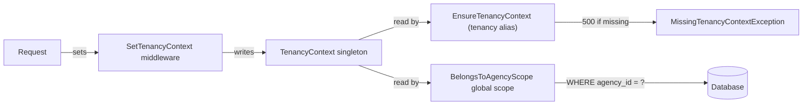

# Tenancy Security Contract

**Status:** authoritative for Phase 1 (Sprint 1 onwards).
**Owners:** Identity & Agencies modules.
**Audience:** every backend engineer adding routes, models, jobs, or admin
tooling that touches tenant data.

---

## 1. The model

Catalyst Engine is row-level multi-tenant. The `agencies` table is the tenant
boundary; every tenant-scoped table carries an `agency_id` column referencing
it. See [`docs/00-MASTER-ARCHITECTURE.md`](../00-MASTER-ARCHITECTURE.md) §4 for
the full architectural rationale.

The runtime contract has three pieces:



| Piece                             | File                                                                                                             | Role                                                                                                                                           |
| --------------------------------- | ---------------------------------------------------------------------------------------------------------------- | ---------------------------------------------------------------------------------------------------------------------------------------------- |
| `TenancyContext`                  | [`apps/api/app/Core/Tenancy/TenancyContext.php`](../../apps/api/app/Core/Tenancy/TenancyContext.php)             | Per-request singleton holding the current `agency_id`. Bound by [`AppServiceProvider`](../../apps/api/app/Providers/AppServiceProvider.php).   |
| `BelongsToAgencyScope`            | [`apps/api/app/Core/Tenancy/BelongsToAgencyScope.php`](../../apps/api/app/Core/Tenancy/BelongsToAgencyScope.php) | Global scope mounted by the `BelongsToAgency` trait. Filters `WHERE agency_id = :ctx` when a context is set; **no-op when no context is set**. |
| `BelongsToAgency` trait           | [`apps/api/app/Core/Tenancy/BelongsToAgency.php`](../../apps/api/app/Core/Tenancy/BelongsToAgency.php)           | Marks a model as tenant-scoped. Throws `MissingAgencyContextException` on `create()` if `agency_id` is unset and no context is active.         |
| `EnsureTenancyContext` middleware | [`apps/api/app/Core/Tenancy/EnsureTenancyContext.php`](../../apps/api/app/Core/Tenancy/EnsureTenancyContext.php) | Registered as the `tenancy` alias. 500s with `MissingTenancyContextException` if it runs without a context already set.                        |
| `SetTenancyContext` middleware    | _added in Sprint 1 chunk 3_                                                                                      | Populates `TenancyContext` from the authenticated user's current agency before `EnsureTenancyContext` runs.                                    |

## 2. The no-op-when-no-context contract

The global scope deliberately does **not** filter when no context is set.

This is what makes admin tooling, queue workers, and `php artisan` commands
usable: they can read across tenants for audit dumps, GDPR exports, support
investigations, billing reconciliation, etc., without sprinkling
`Model::withoutGlobalScope()` everywhere.

The price of that ergonomics is one sharp edge: **if a tenant-scoped HTTP
route runs without a context, queries will silently return cross-tenant
data**. That is a P0 data-leak vulnerability.

We close that edge with three layers of defence:

1. **Writes.** The `BelongsToAgency` trait's `creating` hook throws
   `MissingAgencyContextException` if `agency_id` is unset on insert and
   no context is active. Tested in
   [`tests/Unit/Core/Tenancy/BelongsToAgencyTest.php`](../../apps/api/tests/Unit/Core/Tenancy/BelongsToAgencyTest.php).
2. **HTTP reads and writes.** The `tenancy` middleware alias
   (`EnsureTenancyContext`) 500s on any request that reaches it without a
   context. Tested in
   [`tests/Feature/Tenancy/MissingContextTest.php`](../../apps/api/tests/Feature/Tenancy/MissingContextTest.php).
3. **Code review.** Every PR that adds a route or a job touching
   tenant-scoped models is reviewed against this document.

## 3. Mandatory rule for tenant-scoped routes

> **Every route that reads or writes a tenant-scoped model MUST be inside a
> route group that applies the `tenancy` middleware alias.**

The standard authenticated-API route group is:

```php
Route::middleware(['auth:web', \App\Http\Middleware\SetTenancyContext::class, 'tenancy'])
    ->prefix('api/v1')
    ->group(function (): void {
        // tenant-scoped routes here
    });
```

`SetTenancyContext` (added in chunk 3) populates the context from the
authenticated user's current agency. `tenancy` (already shipped) is the
fail-closed safety net immediately after. Any route lacking either
middleware is forbidden by review.

The `auth:web_admin` guard (Sprint 1 chunk 7) follows the same shape, with
the admin guard substituted: a `SetTenancyContext` populator that resolves
the agency from a `?agency=` query param or path segment when an admin
user is impersonating, and the same `tenancy` guard at the end of the
chain.

## 4. Cross-tenant routes — the explicit allowlist

A small number of routes legitimately span all tenants:

- Auth endpoints (`POST /api/v1/auth/login`, `POST /api/v1/auth/register`)
  — by definition, the user has no agency yet.
- Health endpoints (`/health`, `/up`) — global liveness checks.
- The platform-admin SPA's "list all agencies" view (Sprint 1 chunk 7)
  — admin users intentionally see every tenant.
- Sprint 4+ webhook receivers from external vendors (Stripe Connect, KYC,
  e-sign) where the request must locate its agency from a payload field
  rather than session.

Every cross-tenant route MUST appear in the allowlist below. Adding a route
to the allowlist requires:

1. A PR that touches **both** the route file and this section of the
   document, with the rationale in the description.
2. Approval from a second engineer **and** a security note from the PR
   author explaining why row-level scoping is safe to bypass for that
   route.
3. A feature test that exercises the route specifically to confirm the
   no-context contract is the correct behaviour for it.

### Cross-tenant route allowlist

| Route                                                                        | Method          | Justification                                                                                                                                                                                                                                                                                                                                                                                                                                                                                                                                                                                                                                                                                                                                                                                 | Added in                             |
| ---------------------------------------------------------------------------- | --------------- | --------------------------------------------------------------------------------------------------------------------------------------------------------------------------------------------------------------------------------------------------------------------------------------------------------------------------------------------------------------------------------------------------------------------------------------------------------------------------------------------------------------------------------------------------------------------------------------------------------------------------------------------------------------------------------------------------------------------------------------------------------------------------------------------- | ------------------------------------ |
| `/up`                                                                        | `GET`           | Liveness check; no DB queries.                                                                                                                                                                                                                                                                                                                                                                                                                                                                                                                                                                                                                                                                                                                                                                | Sprint 0.                            |
| `/health`                                                                    | `GET`           | Liveness check; reports service identity only.                                                                                                                                                                                                                                                                                                                                                                                                                                                                                                                                                                                                                                                                                                                                                | Sprint 0.                            |
| `/api/v1/ping`                                                               | `GET`           | Smoke test; returns timestamp only.                                                                                                                                                                                                                                                                                                                                                                                                                                                                                                                                                                                                                                                                                                                                                           | Sprint 0.                            |
| `/api/v1/creators/me`                                                        | `GET`           | Creator is a global entity (data-model § 5); the bootstrap response keys off `auth()->user()->creator`.                                                                                                                                                                                                                                                                                                                                                                                                                                                                                                                                                                                                                                                                                       | Sprint 3 Ch 1.                       |
| `/api/v1/creators/me/wizard/profile`                                         | `PATCH`         | Same — creator-owned wizard step.                                                                                                                                                                                                                                                                                                                                                                                                                                                                                                                                                                                                                                                                                                                                                             | Sprint 3 Ch 1.                       |
| `/api/v1/creators/me/wizard/social`                                          | `POST`          | Same — creator-owned wizard step.                                                                                                                                                                                                                                                                                                                                                                                                                                                                                                                                                                                                                                                                                                                                                             | Sprint 3 Ch 1.                       |
| `/api/v1/creators/me/wizard/kyc`                                             | `POST`          | Same — creator-owned wizard step.                                                                                                                                                                                                                                                                                                                                                                                                                                                                                                                                                                                                                                                                                                                                                             | Sprint 3 Ch 1.                       |
| `/api/v1/creators/me/wizard/tax`                                             | `PATCH`         | Same — creator-owned wizard step.                                                                                                                                                                                                                                                                                                                                                                                                                                                                                                                                                                                                                                                                                                                                                             | Sprint 3 Ch 1.                       |
| `/api/v1/creators/me/wizard/payout`                                          | `POST`          | Same — creator-owned wizard step.                                                                                                                                                                                                                                                                                                                                                                                                                                                                                                                                                                                                                                                                                                                                                             | Sprint 3 Ch 1.                       |
| `/api/v1/creators/me/wizard/contract`                                        | `POST`          | Same — creator-owned wizard step.                                                                                                                                                                                                                                                                                                                                                                                                                                                                                                                                                                                                                                                                                                                                                             | Sprint 3 Ch 1.                       |
| `/api/v1/creators/me/wizard/submit`                                          | `POST`          | Same — creator submits their own application.                                                                                                                                                                                                                                                                                                                                                                                                                                                                                                                                                                                                                                                                                                                                                 | Sprint 3 Ch 1.                       |
| `/api/v1/creators/me/avatar`                                                 | `POST`          | Same — creator uploads their own avatar.                                                                                                                                                                                                                                                                                                                                                                                                                                                                                                                                                                                                                                                                                                                                                      | Sprint 3 Ch 1.                       |
| `/api/v1/creators/me/avatar`                                                 | `DELETE`        | Same — creator removes their own avatar.                                                                                                                                                                                                                                                                                                                                                                                                                                                                                                                                                                                                                                                                                                                                                      | Sprint 3 Ch 1.                       |
| `/api/v1/creators/me/portfolio/images`                                       | `POST`          | Same — creator uploads to their own portfolio.                                                                                                                                                                                                                                                                                                                                                                                                                                                                                                                                                                                                                                                                                                                                                | Sprint 3 Ch 1.                       |
| `/api/v1/creators/me/portfolio/videos/init`                                  | `POST`          | Same — initiates a presigned-S3 upload scoped to the creator's path prefix.                                                                                                                                                                                                                                                                                                                                                                                                                                                                                                                                                                                                                                                                                                                   | Sprint 3 Ch 1.                       |
| `/api/v1/creators/me/portfolio/videos/complete`                              | `POST`          | Same — completes the presigned upload after the client has PUT to S3.                                                                                                                                                                                                                                                                                                                                                                                                                                                                                                                                                                                                                                                                                                                         | Sprint 3 Ch 1.                       |
| `/api/v1/creators/me/portfolio/{item}`                                       | `DELETE`        | Same — creator removes their own portfolio item.                                                                                                                                                                                                                                                                                                                                                                                                                                                                                                                                                                                                                                                                                                                                              | Sprint 3 Ch 1.                       |
| `/api/v1/jobs/{job}`                                                         | `GET`           | Polled by background-job initiators (e.g. bulk invite); job ownership is verified at the controller.                                                                                                                                                                                                                                                                                                                                                                                                                                                                                                                                                                                                                                                                                          | Sprint 3 Ch 1.                       |
| `/api/v1/agencies/{agency}/invitations`                                      | `POST`          | Path-scoped tenant: agency resolved from path param `{agency}`; in-controller `authorizeAdmin()` enforces membership + AgencyAdmin role. Routed under `auth:web` only because the route lives under the Agencies module's invitation surface, NOT the standard `tenancy.set + tenancy` stack — adding the stack would require a path-param-aware populator that doesn't exist yet (Sprint 2 oversight surfaced during Sprint 3 Chunk 1 audit, added retroactively).                                                                                                                                                                                                                                                                                                                           | Sprint 2 Ch 1 (added Sprint 3 Ch 1). |
| `/api/v1/agencies/{agency}/creators/invitations/bulk`                        | `POST`          | Path-scoped tenant: same pattern as the Sprint 2 invitation route above. `BulkInviteController::authorizeAdmin()` enforces membership + AgencyAdmin role. Mirrors Sprint 2 precedent per D-pause-9 of the chunk kickoff.                                                                                                                                                                                                                                                                                                                                                                                                                                                                                                                                                                      | Sprint 3 Ch 1.                       |
| `/api/v1/creators/invitations/preview`                                       | `GET`           | Tenant-less: unauthenticated. Returns minimal agency context (`agency_name`, `is_expired`, `is_accepted`) only — never the invited email per #42. Token validation enforces token ↔ relation binding; generic 404 on unknown tokens defeats user-enumeration.                                                                                                                                                                                                                                                                                                                                                                                                                                                                                                                                 | Sprint 3 Ch 1.                       |
| `/api/v1/creators/me/wizard/kyc/status`                                      | `GET`           | Creator-scoped wizard status-poll (status-poll branch of the hybrid completion architecture). Reads provider state for the authenticated creator. Lives under the same `creators.me.*` group as the chunk-1 routes — not "cross-tenant" in the admin sense, listed here for the Creator-is-global discipline.                                                                                                                                                                                                                                                                                                                                                                                                                                                                                 | Sprint 3 Ch 2.                       |
| `/api/v1/creators/me/wizard/kyc/return`                                      | `GET`           | Creator-scoped redirect-bounce return URL after vendor hosted flow. Same auth shape as `/wizard/kyc/status`.                                                                                                                                                                                                                                                                                                                                                                                                                                                                                                                                                                                                                                                                                  | Sprint 3 Ch 2.                       |
| `/api/v1/creators/me/wizard/contract/status`                                 | `GET`           | Same — creator-owned wizard status-poll for the e-sign step.                                                                                                                                                                                                                                                                                                                                                                                                                                                                                                                                                                                                                                                                                                                                  | Sprint 3 Ch 2.                       |
| `/api/v1/creators/me/wizard/contract/return`                                 | `GET`           | Same — creator-owned redirect-bounce return URL for the e-sign step.                                                                                                                                                                                                                                                                                                                                                                                                                                                                                                                                                                                                                                                                                                                          | Sprint 3 Ch 2.                       |
| `/api/v1/creators/me/wizard/contract/click-through-accept`                   | `POST`          | Creator-owned click-through fallback when `contract_signing_enabled` is OFF (Q-flag-off-2 = (a)). Stamps `creators.click_through_accepted_at`.                                                                                                                                                                                                                                                                                                                                                                                                                                                                                                                                                                                                                                                | Sprint 3 Ch 2.                       |
| `/api/v1/creators/me/wizard/payout/status`                                   | `GET`           | Same — creator-owned wizard status-poll for the Stripe Connect step.                                                                                                                                                                                                                                                                                                                                                                                                                                                                                                                                                                                                                                                                                                                          | Sprint 3 Ch 2.                       |
| `/api/v1/creators/me/wizard/payout/return`                                   | `GET`           | Same — creator-owned redirect-bounce return URL for the Stripe Connect step.                                                                                                                                                                                                                                                                                                                                                                                                                                                                                                                                                                                                                                                                                                                  | Sprint 3 Ch 2.                       |
| `/api/v1/webhooks/kyc`                                                       | `POST`          | Tenant-less: vendor-driven inbound. Signature verification (HMAC-SHA256) replaces auth; the payload's `creator_ulid` drives the downstream state update inside the Process\*WebhookJob. Idempotent via unique `(provider, provider_event_id)` index on `integration_events`.                                                                                                                                                                                                                                                                                                                                                                                                                                                                                                                  | Sprint 3 Ch 2.                       |
| `/api/v1/webhooks/esign`                                                     | `POST`          | Tenant-less: same shape as the KYC webhook above.                                                                                                                                                                                                                                                                                                                                                                                                                                                                                                                                                                                                                                                                                                                                             | Sprint 3 Ch 2.                       |
| `/api/v1/webhooks/stripe`                                                    | `POST`          | Tenant-less: same shape as the KYC webhook above. Stripe Connect `account.updated`; signature is Stripe's `Stripe-Signature` HMAC + timestamp scheme; the payload's `account.id` correlates to `creator_payout_methods.provider_account_id` inside ProcessStripeWebhookJob. Idempotent via the same `(provider, provider_event_id)` index.                                                                                                                                                                                                                                                                                                                                                                                                                                                    | Sprint 4 Ch 2.                       |
| `/_mock-vendor/kyc/{session}` + `/complete`                                  | `GET`/`POST`    | Tenant-less: development + Playwright mock-vendor pages (chunk-2 sub-step 5). Anonymous-session UX — the unguessable session-token in the URL is the only authenticator (#42). Available in dev/CI; production routes never see real traffic.                                                                                                                                                                                                                                                                                                                                                                                                                                                                                                                                                 | Sprint 3 Ch 2.                       |
| `/_mock-vendor/esign/{session}` + `/complete`                                | `GET`/`POST`    | Same — e-sign mock-vendor.                                                                                                                                                                                                                                                                                                                                                                                                                                                                                                                                                                                                                                                                                                                                                                    | Sprint 3 Ch 2.                       |
| `/_mock-vendor/stripe/{session}` + `/complete`                               | `GET`/`POST`    | Same — Stripe Connect mock-vendor (status-poll only; no webhook in Sprint 3 per Q-stripe-no-webhook-acceptable).                                                                                                                                                                                                                                                                                                                                                                                                                                                                                                                                                                                                                                                                              | Sprint 3 Ch 2.                       |
| `/api/v1/admin/creators/{creator}`                                           | `GET`           | Path-scoped admin tooling: platform_admin reading a single creator. `auth:web_admin` + `EnsureMfaForAdmins` middleware on the route group. Tenancy: tenant-less by category — Creator is a global entity (data-model § 5) and platform_admin users carry no agency membership. `CreatorPolicy::view`'s admin branch is the authorization check. Per-field admin EDIT (PATCH) added in Chunk 4 as a separate allowlist row below.                                                                                                                                                                                                                                                                                                                                                              | Sprint 3 Ch 3.                       |
| `/api/v1/admin/creators/{creator}`                                           | `PATCH`         | Path-scoped admin tooling: platform_admin per-field edit of a single creator (7 editable fields: `display_name`, `bio`, `country_code`, `region`, `primary_language`, `secondary_languages`, `categories`). Same auth shape as the GET row above (`auth:web_admin` + `EnsureMfaForAdmins`). `CreatorPolicy::adminUpdate`'s admin branch authorizes. Field validation lives in `AdminUpdateCreatorRequest`; `reason` is required for changes to `bio`, `country_code`, `region`, `primary_language`, `secondary_languages`, and `categories` (audit trail discipline).                                                                                                                                                                                                                         | Sprint 3 Ch 4.                       |
| `/api/v1/admin/creators/{creator}/approve`                                   | `POST`          | Path-scoped admin tooling: platform_admin approves a creator's application. `auth:web_admin` + `EnsureMfaForAdmins` on the route group. `CreatorPolicy::approve` authorizes. Transitions `application_status` from `pending` to `approved` and stamps `application_decided_at`. Idempotent: returns `creator.already_approved` when called on an already-approved application.                                                                                                                                                                                                                                                                                                                                                                                                                | Sprint 3 Ch 4.                       |
| `/api/v1/admin/creators/{creator}/reject`                                    | `POST`          | Path-scoped admin tooling: platform_admin rejects a creator's application with a mandatory `rejection_reason` (10–2000 chars). Same auth shape and idempotency contract as the approve row above. `CreatorPolicy::reject` authorizes; the reason is persisted on `creators.rejection_reason` and surfaced to the creator on their dashboard.                                                                                                                                                                                                                                                                                                                                                                                                                                                  | Sprint 3 Ch 4.                       |
| `/api/v1/creators/me/wizard/contract/terms`                                  | `GET`           | Creator-scoped: returns the server-rendered HTML for the master agreement. Lives in the same `creators.me.*` group as the Chunk 1 routes. Trust boundary: HTML is sanitised server-side via league/commonmark with `allow_unsafe_links: false` + `html_input: 'escape'` so the SPA's `v-html` rendering of the response body is safe end-to-end.                                                                                                                                                                                                                                                                                                                                                                                                                                              | Sprint 3 Ch 3.                       |
| `/api/v1/_test/queue-mode`                                                   | `POST`/`DELETE` | Tenant-less test-helper (chunk 6.1 surface): allows the chunk-3 Playwright happy-path spec to flip `config('queue.default')` between `sync` and `database`/`redis`. Gated by the dual provider gate + `VerifyTestHelperToken` middleware — production environments cannot reach this route. Pair with `setQueueMode`/`clearQueueMode` Playwright fixtures.                                                                                                                                                                                                                                                                                                                                                                                                                                    | Sprint 3 Ch 3.                       |
| `/api/v1/creators/me/availability`                                           | `GET`           | Creator-scoped: the authenticated creator's own availability blocks, expanded into occurrences for a window. Lives in the `creators.me.*` group (`auth:web` + `tenancy.set` + `verified`); keys off `$request->user()->creator` — Creator is a global entity (data-model § 5), not tenant-scoped. Listed here for the Creator-is-global discipline.                                                                                                                                                                                                                                                                                                                                                                                                                                           | Sprint 5 Ch A.                       |
| `/api/v1/creators/me/availability`                                           | `POST`          | Same — creator creates one of their own availability blocks. Validation: tz-aware range, `block_type`/`kind` enums (`kind` excludes `assignment_auto`), weekly-only `recurrence_rule`.                                                                                                                                                                                                                                                                                                                                                                                                                                                                                                                                                                                                        | Sprint 5 Ch A.                       |
| `/api/v1/creators/me/availability/{block}`                                   | `PATCH`         | Same — creator updates their own block. Ownership is structural: the block is resolved from `$request->user()->creator->availabilityBlocks()`, never a path id, so a non-owner `{block}` is simply not found (404).                                                                                                                                                                                                                                                                                                                                                                                                                                                                                                                                                                           | Sprint 5 Ch A.                       |
| `/api/v1/creators/me/availability/{block}`                                   | `DELETE`        | Same — creator deletes their own block; same structural owner-only resolve as the PATCH row above.                                                                                                                                                                                                                                                                                                                                                                                                                                                                                                                                                                                                                                                                                            | Sprint 5 Ch A.                       |
| `/api/v1/creators/me/connection-requests`                                    | `GET`           | Creator-scoped: the authenticated creator's own PENDING agency-sent connection requests (Sprint 6.6b, D-8). Cross-module READ of an Agencies model (`AgencyCreatorRelation`) — resolved from `$request->user()->creator` by `creator_id`, never a path agency id. The `BelongsToAgencyScope` global scope is deliberately dropped (the one justified HTTP bypass, mirroring the discovery controller): the caller is a creator who may have requests from many agencies, so any ambient tenant context must NOT narrow the set. Lives in the `creators/me/*` group.                                                                                                                                                                                                                           | Sprint 6.6b.                         |
| `/api/v1/creators/me/connection-requests/{relation}/accept`                  | `POST`          | Same — creator accepts one of their own pending requests (`pending_request → roster`). Ownership is structural (resolved within `creator_id`); fail-closed on the `pending_request` source state (D-2). Same scope-bypass rationale as the GET row above.                                                                                                                                                                                                                                                                                                                                                                                                                                                                                                                                     | Sprint 6.6b.                         |
| `/api/v1/creators/me/connection-requests/{relation}/decline`                 | `POST`          | Same — creator declines one of their own pending requests (`pending_request → declined`). The row is retained so the agency can re-request (D-4). Same structural ownership + fail-closed guard + scope-bypass rationale as the accept row above.                                                                                                                                                                                                                                                                                                                                                                                                                                                                                                                                             | Sprint 6.6b.                         |
| `/api/v1/creators/me/assignments`                                            | `GET`           | Creator-scoped: the authenticated creator's own campaign assignments (Sprint 8 Chunk 2, D-9). Cross-module READ of a Campaigns model (`CampaignAssignment`) — resolved from `$request->user()->creator` by `creator_id`, never a path agency id. `BelongsToAgencyScope` is deliberately dropped (the same justified HTTP bypass as connection-requests): the caller is a creator who may carry invitations from many agencies, so ambient tenant context must NOT narrow the set. Lives in the `creators/me/*` group (`auth:web` + `tenancy.set` + `verified`).                                                                                                                                                                                                                               | Sprint 8 Ch 2.                       |
| `/api/v1/creators/me/assignments/{assignment}/accept`                        | `POST`          | Same — creator accepts one of their own invitations (`invited → accepted`, via the `CampaignAssignmentStateMachine`). Ownership is structural (resolved within `creator_id`); fail-closed on the `invited` source state. Accept also auto-blocks the creator's calendar over the campaign's posting window (D-11). Same scope-bypass rationale as the GET row above.                                                                                                                                                                                                                                                                                                                                                                                                                          | Sprint 8 Ch 2.                       |
| `/api/v1/creators/me/assignments/{assignment}/decline`                       | `POST`          | Same — creator declines one of their own invitations (`invited → declined`, via the machine). Same structural ownership + fail-closed guard + scope-bypass rationale as the accept row above.                                                                                                                                                                                                                                                                                                                                                                                                                                                                                                                                                                                                 | Sprint 8 Ch 2.                       |
| `/api/v1/creators/me/assignments/{assignment}/counter`                       | `POST`          | Same — creator counters one of their own invitations with a proposed fee (`invited → countered`, recording `countered_fee_*` without touching `agreed_fee_*`, via the machine). Fee is a positive integer in minor units; currency must equal the campaign's `budget_currency` when set (D-8). Same structural ownership + fail-closed guard + scope-bypass rationale as the accept row above.                                                                                                                                                                                                                                                                                                                                                                                                | Sprint 8 Ch 2.                       |
| `/api/v1/creators/me/assignments/{assignment}`                               | `GET`           | Creator-scoped: the detail payload for one of the creator's OWN assignments + its full draft version history + posted content (Sprint 9 Chunk 1, D-9 — the creator detail route reads this). Cross-module READ of Campaigns models (`CampaignAssignment`, `CampaignDraft`, `CampaignPostedContent`) resolved from `$request->user()->creator` by `creator_id`, never a path id; `BelongsToAgencyScope` dropped (same justified bypass as the rows above). A non-owned ULID is 404.                                                                                                                                                                                                                                                                                                            | Sprint 9 Ch 1.                       |
| `/api/v1/creators/me/assignments/{assignment}/drafts`                        | `POST`          | Same — creator submits / resubmits a draft (Sprint 9 Chunk 1, D-5/D-6). Creates a versioned `campaign_drafts` row, then drives the assignment to `draft_submitted` via the `CampaignAssignmentStateMachine` (producing → draft_submitted directly, or the two-step `startProducing()` path from `contracted`/`revision_requested`, D-4). Fail-closed: rejected (422 `assignment.not_producible`) unless the source state can reach `draft_submitted`. Media paths must belong to the creator's own `drafts` prefix (422 `draft.media_invalid`). Same structural ownership + scope-bypass as above.                                                                                                                                                                                            | Sprint 9 Ch 1.                       |
| `/api/v1/creators/me/assignments/{assignment}/drafts/media/init`             | `POST`          | Same — initiate a presigned S3 upload for draft media (Sprint 9 Chunk 1, D-8). Reuses `PortfolioUploadService` under the `drafts` namespace (`creators/{ulid}/drafts/…`, no portfolio capacity cap, image+video MIME). Returns the presigned URL + `upload_id`; the client PUTs the bytes with the exact signed Content-Type. Ownership of the `{assignment}` ULID is resolved structurally before a URL is issued. Same scope-bypass as above.                                                                                                                                                                                                                                                                                                                                               | Sprint 9 Ch 1.                       |
| `/api/v1/creators/me/assignments/{assignment}/drafts/media/complete`         | `POST`          | Same — verify the presigned draft-media upload landed and return its storage path for the draft submission (Sprint 9 Chunk 1, D-8). The `upload_id` is prefix-checked against the creator's own `drafts` namespace (cross-creator / cross-namespace paths rejected). Same structural ownership + scope-bypass as above.                                                                                                                                                                                                                                                                                                                                                                                                                                                                       | Sprint 9 Ch 1.                       |
| `/api/v1/creators/me/assignments/{assignment}/posted-content`                | `POST`          | Same — creator self-reports the published post (Sprint 9 Chunk 1, D-7). Creates a `campaign_posted_content` row (`verification_status=pending`) + drives `approved → posted` via the machine (`markPosted()`). Fail-closed: rejected (422 `assignment.not_approved`) unless the assignment is `approved`. The arc STOPS here (`verifyLive` is vendor-gated, Chunk 2). Same structural ownership + scope-bypass as above.                                                                                                                                                                                                                                                                                                                                                                      | Sprint 9 Ch 1.                       |
| `/api/v1/creators/me/assignments/{assignment}/posted-content`                | `PATCH`         | Same — creator edits the post URL IN PLACE after a FAILED auto-verification (verification-resolution chunk, ACT3/D-6). Updates the latest `campaign_posted_content` row's `post_url` (+ optional `platform`), resets `verification_status → pending` (clearing `verified_at`/`platform_post_id`) and re-dispatches the idempotent `VerifyPostedContentJob` (the reset re-arms it). NO state transition (stays `posted`). Fail-closed: rejected (422 `assignment.not_resolvable`) unless the assignment is `posted` AND the latest post failed (`not_found`/`mismatch`) — the agency's in-place request is a nudge, not a precondition. Audits `assignment.posted_content_updated` (the creator's mutation, free-text URL not snapshotted). Same structural ownership + scope-bypass as above. | Verification-resolution chunk.       |
| `/api/v1/creators/me/assignments/{assignment}/contract/accept`               | `POST`          | Creator-scoped: accept a pending per-campaign contract on one of the creator's OWN assignments (`accepted → contracted`, via `CampaignAssignmentStateMachine::contract()`). Resolves the pending `contracts` row (`subject_type=campaign_assignment`, `status=sent`), stamps `signed_at`, sets `assignment.contract_id`. Fail-closed: rejected unless assignment is `accepted` and a sent contract exists; flag OFF → 422 `assignment.per_campaign_contract_disabled` (re-pointed off the e-sign vendor flag to `per_campaign_contract_enabled`, contract-gate-decouple chunk D-3). Same structural ownership + scope-bypass as the assignment rows above.                                                                                                                                    | Contract-bridge chunk.               |
| `/api/v1/creators/me/assignments/{assignment}/messages`                      | `GET`           | Creator-scoped: the message feed for one of the creator's OWN assignment threads (Sprint 11, D-11/D-16). Cross-module READ of a Messaging model (`MessageThread`/`Message`) resolved from `$request->user()->creator` by `creator_id`, never a path agency id; `BelongsToAgencyScope` dropped (the same justified bypass as the assignment rows above — a creator carries threads across many agencies). The thread is lazily provisioned on first read (D-3). A non-owned `{assignment}` ULID is 404 (absence, not 403).                                                                                                                                                                                                                                                                     | Sprint 11.                           |
| `/api/v1/creators/me/assignments/{assignment}/messages`                      | `POST`          | Same — creator sends a message on their own thread (`sender_role=creator`). Terminal-guarded: 422 `message.thread_closed` once the assignment is declined/rejected/cancelled (D-13 + Q2); `payment_released` stays open. Same structural ownership + scope-bypass as the GET row above.                                                                                                                                                                                                                                                                                                                                                                                                                                                                                                       | Sprint 11.                           |
| `/api/v1/creators/me/assignments/{assignment}/messages/read`                 | `POST`          | Same — creator marks their thread's messages read (per-user receipts, idempotent via the `(message_id, user_id)` UNIQUE). Same structural ownership + scope-bypass as the GET row above.                                                                                                                                                                                                                                                                                                                                                                                                                                                                                                                                                                                                      | Sprint 11.                           |
| `/api/v1/creators/me/assignments/{assignment}/messages/attachments/init`     | `POST`          | Same — initiate a presigned S3 upload for a message attachment (Sprint 11, D-6). Thread-keyed (`messages/{thread_ulid}/…`) via the dedicated `MessageAttachmentUploadService`; returns the presigned URL + `upload_id`. The thread is resolved structurally (creator's own assignment) before a URL is issued. Same scope-bypass as the GET row above.                                                                                                                                                                                                                                                                                                                                                                                                                                        | Sprint 11.                           |
| `/api/v1/creators/me/assignments/{assignment}/messages/attachments/complete` | `POST`          | Same — verify the presigned attachment upload landed; the `upload_id` is prefix-checked against the thread's own `messages/{thread_ulid}/` namespace (cross-thread / cross-creator paths rejected). Same structural ownership + scope-bypass as the GET row above.                                                                                                                                                                                                                                                                                                                                                                                                                                                                                                                            | Sprint 11.                           |
| `/api/v1/me/notifications`                                                   | `GET`           | User-scoped: the authenticated user's own in-app notification feed (S11.0 Chunk 1, D-8/D-9). Notifications are **user-level, above tenancy** — both agency users and creators hit the same surface. The `Notification` model deliberately omits `BelongsToAgency` (no `agency_id`); isolation is `recipient_user_id = $request->user()->id` at the controller, never a path id. Mounted `auth:web` + `tenancy.set` (the `/me` stack); `tenancy.set` is a documented no-op for this pure user-scope query and the fail-closed `tenancy` alias is NOT applied (creators/admins have no agency context). User A's feed never contains user B's rows (absence-tested).                                                                                                                            | S11.0 Ch 1.                          |
| `/api/v1/me/notifications/unread-count`                                      | `GET`           | Same — cheap count-only of the caller's unread rows. Same user-scope + middleware as the feed row above.                                                                                                                                                                                                                                                                                                                                                                                                                                                                                                                                                                                                                                                                                      | S11.0 Ch 1.                          |
| `/api/v1/me/notifications/{notification}/read`                               | `PATCH`         | Same — mark one of the caller's OWN notifications read. Ownership is structural (resolved within `recipient_user_id` by ULID); a non-owned `{notification}` is simply 404 `notification.not_found` (no cross-user enumeration). Idempotent per §5.6: re-marking an already-read row preserves the original `read_at`.                                                                                                                                                                                                                                                                                                                                                                                                                                                                         | S11.0 Ch 1.                          |
| `/api/v1/me/notifications/read-all`                                          | `POST`          | Same — mark every unread row of the caller read. Idempotent: a feed with nothing unread marks zero and writes nothing. Same user-scope + middleware as above.                                                                                                                                                                                                                                                                                                                                                                                                                                                                                                                                                                                                                                 | S11.0 Ch 1.                          |
| `/api/v1/me/notification-preferences`                                        | `GET`           | User-scoped: the caller's own notification preferences (S11.0 Chunk 3b). Same user-level-above-tenancy posture as the feed above — `NotificationPreference` omits `BelongsToAgency`; scope is `user_id = $request->user()->id`, never a path id. Returns the caller's SPARSE rows (only divergences from the channel default) plus the server-authoritative `defaults` block. Same `auth:web` + `tenancy.set` (no-op) stack. A caller can never read another user's preferences (absence-tested).                                                                                                                                                                                                                                                                                             | S11.0 Ch 3b.                         |
| `/api/v1/me/notification-preferences`                                        | `PATCH`         | Same user-scope — the product's first user **self-write**. Sparse upsert/delete per toggle (divergence → `updateOrCreate`; return-to-default → delete), so the preserve-current contract stays the source of truth. No path id, no policy; the owner is `$request->user()`. A caller can only ever write their own rows (absence-tested).                                                                                                                                                                                                                                                                                                                                                                                                                                                     | S11.0 Ch 3b.                         |
| `/api/v1/admin/agencies`                                                     | `GET`           | Sprint-13 admin panel (D-3). Cross-agency by design: the platform admin lists EVERY agency. Mounted `auth:web_admin` + `EnsureMfaForAdmins`; tenant-less (platform_admin carries no membership). The `tenancy` alias is deliberately NOT mounted on the admin group (it would 500 every request); reads are explicit tenant-less queries.                                                                                                                                                                                                                                                                                                                                                                                                                                                     | Sprint 13 (D-3).                     |
| `/api/v1/admin/agencies/{agency}`                                            | `GET`           | Same admin stack — a single agency's detail across the tenant boundary.                                                                                                                                                                                                                                                                                                                                                                                                                                                                                                                                                                                                                                                                                                                       | Sprint 13 (D-3).                     |
| `/api/v1/admin/agencies/{agency}/suspend`                                    | `POST`          | Same admin stack. Flips `agencies.is_active` false (transactional audit `agency.suspended`, reason required). Enforcement lands at the AUTH layer: `AuthService::login` blocks a suspended PRIMARY agency's users with the 423 `auth.account_locked.suspended` envelope (no session) — `AgencySuspensionLoginTest`.                                                                                                                                                                                                                                                                                                                                                                                                                                                                           | Sprint 13 (D-3).                     |
| `/api/v1/admin/agencies/{agency}/reactivate`                                 | `POST`          | Same admin stack — the reverse flip (transactional audit `agency.reactivated`). Restores login for the agency's users.                                                                                                                                                                                                                                                                                                                                                                                                                                                                                                                                                                                                                                                                        | Sprint 13 (D-3).                     |
| `/api/v1/admin/audit-logs`                                                   | `GET`           | Same admin stack (D-5). Read-only, cross-agency, cursor-paginated view over the append-only `audit_logs` table; all filters hit indexed columns. Tenant-less by category — the audit trail spans every agency.                                                                                                                                                                                                                                                                                                                                                                                                                                                                                                                                                                                | Sprint 13 (D-5).                     |
| `/api/v1/admin/feature-flags`                                                | `GET`           | Same admin stack (D-6). Lists the platform's DB-backed Pennant flags. Platform-level (no tenant scope).                                                                                                                                                                                                                                                                                                                                                                                                                                                                                                                                                                                                                                                                                       | Sprint 13 (D-6).                     |
| `/api/v1/admin/feature-flags/{flag}`                                         | `POST`          | Same admin stack — the runtime on/off flip. Each toggle writes a `feature_flag.toggled` audit row (reason required), transactional.                                                                                                                                                                                                                                                                                                                                                                                                                                                                                                                                                                                                                                                           | Sprint 13 (D-6).                     |
| `/api/v1/admin/dashboard/summary` · `/activity`                              | `GET`           | Same admin stack (D-7). Non-payment operational KPIs + the recent cross-agency audit-activity feed. Payment/dispute cards are stable null placeholders (D-13).                                                                                                                                                                                                                                                                                                                                                                                                                                                                                                                                                                                                                                | Sprint 13 (D-7).                     |
| `/api/v1/admin/health`                                                       | `GET`           | Same admin stack (D-8). Cheap liveness probe over DB + cache. Platform infrastructure, not an agency resource.                                                                                                                                                                                                                                                                                                                                                                                                                                                                                                                                                                                                                                                                                | Sprint 13 (D-8).                     |
| `/api/v1/admin/impersonate/users`                                            | `GET`           | Same admin stack (D-9). Cross-agency user search for the impersonation start flow. platform_admin / self are excluded as targets.                                                                                                                                                                                                                                                                                                                                                                                                                                                                                                                                                                                                                                                             | Sprint 13 (D-9).                     |
| `/api/v1/admin/impersonate`                                                  | `POST`          | Same admin stack — mints a ONE-TIME hand-off token + persists an `admin_impersonation_sessions` row (server-authoritative `expires_at` TTL). Mandatory reason. Refuses self / platform_admin targets and a SECOND active session (no nesting). The admin's own `web_admin` session is never destroyed.                                                                                                                                                                                                                                                                                                                                                                                                                                                                                        | Sprint 13 (D-9).                     |
| `/api/v1/admin/impersonate/end`                                              | `POST`          | Same admin stack — ends the admin-side marker.                                                                                                                                                                                                                                                                                                                                                                                                                                                                                                                                                                                                                                                                                                                                                | Sprint 13 (D-9).                     |
| `/api/v1/admin/impersonate/sessions`                                         | `GET`           | Same admin stack — the impersonation LOG (§6.8 log of record). Read-only, cross-agency, cursor-paginated view over the append-only `admin_impersonation_sessions` table; status derived from the TTL authority (`ended_at` / `expires_at`), `q` matches either party. Tenant-less by category.                                                                                                                                                                                                                                                                                                                                                                                                                                                                                                | Sprint 13 (D-9).                     |
| `/api/v1/auth/impersonation/claim`                                           | `POST`          | MAIN SPA (`auth:web`), the two-cookie bridge: consumes the one-time token and establishes the IMPERSONATED user's `web` session (the admin's `web_admin` session is untouched — dual-session). Listed here as the impersonation surface, not a tenant bypass: the impersonated session is an ordinary `web` user session, still subject to `EnforceImpersonation` (server-side TTL + hard-blocks).                                                                                                                                                                                                                                                                                                                                                                                            | Sprint 13 (D-9/D-10).                |
| `/api/v1/auth/impersonation/end` · `/status`                                 | `POST`/`GET`    | Same main-SPA surface — end the impersonated session / hydrate the banner (active + expiry). `EnforceImpersonation` runs per-request on the `web` session.                                                                                                                                                                                                                                                                                                                                                                                                                                                                                                                                                                                                                                    | Sprint 13 (D-10).                    |
| `/api/v1/admin/compliance/export-requests` · `/erasure-queue`                | `GET`           | Same admin stack (D-11) — GDPR export/erasure operator SHELLS. Return `data: []` + `meta.shell: true` (200, not 404) until S14 lands the backing tables. Cross-agency platform compliance function.                                                                                                                                                                                                                                                                                                                                                                                                                                                                                                                                                                                           | Sprint 13 (D-11).                    |
| `/api/v1/admin/alerts`                                                       | `GET`           | Same admin stack (D-12) — the non-payment admin notification consumer: the admin's OWN operational alerts (`recipient_user_id = admin`, user-level-above-tenancy, reusing the S11.0 subsystem). Payment-event alerts held back (coming-soon, D-13) under `meta.payment_alerts`.                                                                                                                                                                                                                                                                                                                                                                                                                                                                                                               | Sprint 13 (D-12).                    |

(Auth endpoints will be added to this table in Sprint 1 chunk 3 when the
endpoints themselves land. Admin agency-listing routes will be added in
Sprint 1 chunk 7.)

**Sprint 12 (Boards & Automation) — NOT allowlisted (standard agency-scoped).**
The board surface routes are deliberately **absent** from the allowlist above
because they are ordinary tenant-scoped routes, not bypasses. All ride the
standard `agencies/{agency}` stack (`auth:web` + `tenancy.agency` + `tenancy`),
so a tenant context is always set and the `BelongsToAgencyScope` global scope is
active:

- `GET    /api/v1/agencies/{agency}/campaigns/{campaign}/board`
- `GET    /api/v1/agencies/{agency}/campaigns/{campaign}/drafts`
- `POST   …/board/columns` · `PATCH …/board/columns/reorder` · `PATCH/DELETE …/board/columns/{column}`
- `GET    …/board/automations` · `PATCH …/board/automations/{automation}`
- `POST   …/board/cards/{card}/move` · `GET …/board/cards/{card}/movements`
- `POST   …/board/reset-to-defaults` (Sprint 12 Ch3 — `update`-gated; the destructive re-seed)

`Board`, `BoardColumn`, and `BoardCard` carry `agency_id` + `BelongsToAgency`
(D-2), so a cross-agency `{column}`/`{card}` ULID is already filtered to a 404 at
route-model binding. `BoardAutomation` + `BoardCardMovement` are not scoped
(they reach tenancy through `board_id`/`card_id`); their controllers add an
explicit parent-of-board check. **Every** cross-tenant / cross-campaign mismatch
returns **404 (absence, not 403)** — the `assertBelongsToAgency` precedent (no
ULID-validity leak). The lazy board-provisioning + card-heal that runs inside the
board `GET` (and the invite listener) bypasses the scope via the named
`withoutGlobalScope(BelongsToAgencyScope::class)` construct (§5) with an explicit
`agency_id` derived from the already-resolved campaign — idempotent
infrastructure keyed on the `boards.campaign_id` / `board_cards.assignment_id`
UNIQUEs, never a cross-tenant read.

**Campaign-wide draft list (Drafts tab) — same category.** `GET …/campaigns/{campaign}/drafts` is standard agency-scoped (NOT in the bypass allowlist above). `campaign_drafts` has no `BelongsToAgency` trait — isolation rides the two-hop join (`campaign_drafts → campaign_assignments` filtered by `campaign_id` + `agency_id`) plus `assertBelongsToAgency($campaign, $agency)` in the controller (404 on mismatch, not 403). The list is view-gated; the review drawer continues to use the existing review-gated `GET …/assignments/{assignment}`.

**Sprint 12 Chunk 3 — the `boards:scan-overdue` console sweep (cross-agency).**
The daily overdue command ([`OverdueScanService`](../../apps/api/app/Modules/Boards/Services/OverdueScanService.php))
runs in a console with **no ambient agency context** (so `BelongsToAgencyScope`
is a no-op — the MessageDigestService lesson, §5.2 below). It is a **deliberate
global sweep** across ALL agencies via `withoutGlobalScope(BelongsToAgencyScope::class)`,
then hands each overdue assignment to `BoardAutomationService::processEvent()`,
which **self-resolves the card's board (hence agency) from the assignment** — so
agency A's automation config can never move agency B's card. Per-card isolation
is structural (the engine), not query-scoped. Pinned by the cross-agency ABSENCE
test (the MessageDigestTest mirror). This is the second consumer of the
"scheduled fan-out/sweep must scope explicitly or globally-sweep + self-resolve"
console-tenancy pattern.

**Categorization note:** the rows above span three distinct categories that
the table currently collapses into one: **(a) cross-tenant** (admin tooling
that legitimately spans tenants), **(b) tenant-less** (no tenant data —
liveness, public preview), **(c) path-scoped tenant** (tenant resolved from
URL path param, not session). A dedicated housekeeping commit will introduce
a `Category` column and recategorize all rows; tracked in `docs/tech-debt.md`.

## 5. Cross-tenant access from non-HTTP code

Queue jobs, scheduled commands, and admin scripts run **without** an
implicit tenant context. They have two legitimate patterns:

### 5.1 Pinned to a single tenant

When a job is "for this agency" — sending notifications, generating an
agency-scoped export, processing a Stripe Connect webhook — wrap the
work in `TenancyContext::runAs($agencyId, fn() => …)`:

```php
app(TenancyContext::class)->runAs($agency->id, function () use ($campaign): void {
    // every Eloquent query inside this closure is scoped to $agency.
});
```

`runAs` restores the previous context (typically `null`) on exit, so
nested or concurrent contexts cannot leak.

### 5.2 Intentionally cross-tenant

Audit aggregation, GDPR right-to-be-forgotten sweeps, finance
reconciliation, and platform-admin tooling sometimes need to address
all rows regardless of tenant. These call sites must use the explicit
bypass:

```php
SomeTenantModel::withoutGlobalScope(BelongsToAgencyScope::class)
    ->where('created_at', '>=', $cutoff)
    ->each(...);
```

The bypass appears in code review as a deliberate, named, greppable
construct. Bare `Model::all()` calls on tenant-scoped models in
non-HTTP code are forbidden — code review will reject them.

## 6. Review checklist

When reviewing a PR that touches tenant-scoped data, verify:

- [ ] New route is inside a route group that applies the `tenancy` middleware,
      OR added to the cross-tenant allowlist in §4 of this document.
- [ ] New tenant-scoped model uses the `BelongsToAgency` trait.
- [ ] New job that touches tenant-scoped models either calls
      `TenancyContext::runAs(...)` or uses `withoutGlobalScope(BelongsToAgencyScope::class)`.
- [ ] No bare `withoutGlobalScope` calls in HTTP request paths — that
      bypass is for non-HTTP code.
- [ ] `MissingTenancyContextException` and `MissingAgencyContextException`
      are not caught and swallowed anywhere; they are programmer errors
      that must surface.

## 7. Testing the contract

The fail-closed contract is regression-tested in:

- [`apps/api/tests/Feature/Tenancy/MissingContextTest.php`](../../apps/api/tests/Feature/Tenancy/MissingContextTest.php)
  — proves the `tenancy` middleware 500s with a clear exception when no
  context is set, and passes through when a context is set.
- [`apps/api/tests/Unit/Core/Tenancy/BelongsToAgencyTest.php`](../../apps/api/tests/Unit/Core/Tenancy/BelongsToAgencyTest.php)
  — proves the global scope filters by current context, throws on
  `create()` without context, and returns null on cross-agency `find()`.

These tests must remain green for every PR. CI runs them on every push
to every branch.
