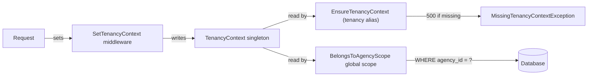

# Tenancy Security Contract

**Status:** authoritative for Phase 1 (Sprint 1 onwards).
**Owners:** Identity & Agencies modules.
**Audience:** every backend engineer adding routes, models, jobs, or admin
tooling that touches tenant data.

---

## 1. The model

Catalyst Engine is row-level multi-tenant. The `agencies` table is the tenant
boundary; every tenant-scoped table carries an `agency_id` column referencing
it. See [`docs/00-MASTER-ARCHITECTURE.md`](../00-MASTER-ARCHITECTURE.md) §4 for
the full architectural rationale.

The runtime contract has three pieces:



| Piece                             | File                                                                                                             | Role                                                                                                                                           |
| --------------------------------- | ---------------------------------------------------------------------------------------------------------------- | ---------------------------------------------------------------------------------------------------------------------------------------------- |
| `TenancyContext`                  | [`apps/api/app/Core/Tenancy/TenancyContext.php`](../../apps/api/app/Core/Tenancy/TenancyContext.php)             | Per-request singleton holding the current `agency_id`. Bound by [`AppServiceProvider`](../../apps/api/app/Providers/AppServiceProvider.php).   |
| `BelongsToAgencyScope`            | [`apps/api/app/Core/Tenancy/BelongsToAgencyScope.php`](../../apps/api/app/Core/Tenancy/BelongsToAgencyScope.php) | Global scope mounted by the `BelongsToAgency` trait. Filters `WHERE agency_id = :ctx` when a context is set; **no-op when no context is set**. |
| `BelongsToAgency` trait           | [`apps/api/app/Core/Tenancy/BelongsToAgency.php`](../../apps/api/app/Core/Tenancy/BelongsToAgency.php)           | Marks a model as tenant-scoped. Throws `MissingAgencyContextException` on `create()` if `agency_id` is unset and no context is active.         |
| `EnsureTenancyContext` middleware | [`apps/api/app/Core/Tenancy/EnsureTenancyContext.php`](../../apps/api/app/Core/Tenancy/EnsureTenancyContext.php) | Registered as the `tenancy` alias. 500s with `MissingTenancyContextException` if it runs without a context already set.                        |
| `SetTenancyContext` middleware    | _added in Sprint 1 chunk 3_                                                                                      | Populates `TenancyContext` from the authenticated user's current agency before `EnsureTenancyContext` runs.                                    |

## 2. The no-op-when-no-context contract

The global scope deliberately does **not** filter when no context is set.

This is what makes admin tooling, queue workers, and `php artisan` commands
usable: they can read across tenants for audit dumps, GDPR exports, support
investigations, billing reconciliation, etc., without sprinkling
`Model::withoutGlobalScope()` everywhere.

The price of that ergonomics is one sharp edge: **if a tenant-scoped HTTP
route runs without a context, queries will silently return cross-tenant
data**. That is a P0 data-leak vulnerability.

We close that edge with three layers of defence:

1. **Writes.** The `BelongsToAgency` trait's `creating` hook throws
   `MissingAgencyContextException` if `agency_id` is unset on insert and
   no context is active. Tested in
   [`tests/Unit/Core/Tenancy/BelongsToAgencyTest.php`](../../apps/api/tests/Unit/Core/Tenancy/BelongsToAgencyTest.php).
2. **HTTP reads and writes.** The `tenancy` middleware alias
   (`EnsureTenancyContext`) 500s on any request that reaches it without a
   context. Tested in
   [`tests/Feature/Tenancy/MissingContextTest.php`](../../apps/api/tests/Feature/Tenancy/MissingContextTest.php).
3. **Code review.** Every PR that adds a route or a job touching
   tenant-scoped models is reviewed against this document.

## 3. Mandatory rule for tenant-scoped routes

> **Every route that reads or writes a tenant-scoped model MUST be inside a
> route group that applies the `tenancy` middleware alias.**

The standard authenticated-API route group is:

```php
Route::middleware(['auth:web', \App\Http\Middleware\SetTenancyContext::class, 'tenancy'])
    ->prefix('api/v1')
    ->group(function (): void {
        // tenant-scoped routes here
    });
```

`SetTenancyContext` (added in chunk 3) populates the context from the
authenticated user's current agency. `tenancy` (already shipped) is the
fail-closed safety net immediately after. Any route lacking either
middleware is forbidden by review.

The `auth:web_admin` guard (Sprint 1 chunk 7) follows the same shape, with
the admin guard substituted: a `SetTenancyContext` populator that resolves
the agency from a `?agency=` query param or path segment when an admin
user is impersonating, and the same `tenancy` guard at the end of the
chain.

## 4. Cross-tenant routes — the explicit allowlist

A small number of routes legitimately span all tenants:

- Auth endpoints (`POST /api/v1/auth/login`, `POST /api/v1/auth/register`)
  — by definition, the user has no agency yet.
- Health endpoints (`/health`, `/up`) — global liveness checks.
- The platform-admin SPA's "list all agencies" view (Sprint 1 chunk 7)
  — admin users intentionally see every tenant.
- Sprint 4+ webhook receivers from external vendors (Stripe Connect, KYC,
  e-sign) where the request must locate its agency from a payload field
  rather than session.

Every cross-tenant route MUST appear in the allowlist below. Adding a route
to the allowlist requires:

1. A PR that touches **both** the route file and this section of the
   document, with the rationale in the description.
2. Approval from a second engineer **and** a security note from the PR
   author explaining why row-level scoping is safe to bypass for that
   route.
3. A feature test that exercises the route specifically to confirm the
   no-context contract is the correct behaviour for it.

### Cross-tenant route allowlist

| Route                                                      | Method       | Justification                                                                                                                                                                                                                                                                                                                                                                                                                                                       | Added in                             |
| ---------------------------------------------------------- | ------------ | ------------------------------------------------------------------------------------------------------------------------------------------------------------------------------------------------------------------------------------------------------------------------------------------------------------------------------------------------------------------------------------------------------------------------------------------------------------------- | ------------------------------------ |
| `/up`                                                      | `GET`        | Liveness check; no DB queries.                                                                                                                                                                                                                                                                                                                                                                                                                                      | Sprint 0.                            |
| `/health`                                                  | `GET`        | Liveness check; reports service identity only.                                                                                                                                                                                                                                                                                                                                                                                                                      | Sprint 0.                            |
| `/api/v1/ping`                                             | `GET`        | Smoke test; returns timestamp only.                                                                                                                                                                                                                                                                                                                                                                                                                                 | Sprint 0.                            |
| `/api/v1/creators/me`                                      | `GET`        | Creator is a global entity (data-model § 5); the bootstrap response keys off `auth()->user()->creator`.                                                                                                                                                                                                                                                                                                                                                             | Sprint 3 Ch 1.                       |
| `/api/v1/creators/me/wizard/profile`                       | `PATCH`      | Same — creator-owned wizard step.                                                                                                                                                                                                                                                                                                                                                                                                                                   | Sprint 3 Ch 1.                       |
| `/api/v1/creators/me/wizard/social`                        | `POST`       | Same — creator-owned wizard step.                                                                                                                                                                                                                                                                                                                                                                                                                                   | Sprint 3 Ch 1.                       |
| `/api/v1/creators/me/wizard/kyc`                           | `POST`       | Same — creator-owned wizard step.                                                                                                                                                                                                                                                                                                                                                                                                                                   | Sprint 3 Ch 1.                       |
| `/api/v1/creators/me/wizard/tax`                           | `PATCH`      | Same — creator-owned wizard step.                                                                                                                                                                                                                                                                                                                                                                                                                                   | Sprint 3 Ch 1.                       |
| `/api/v1/creators/me/wizard/payout`                        | `POST`       | Same — creator-owned wizard step.                                                                                                                                                                                                                                                                                                                                                                                                                                   | Sprint 3 Ch 1.                       |
| `/api/v1/creators/me/wizard/contract`                      | `POST`       | Same — creator-owned wizard step.                                                                                                                                                                                                                                                                                                                                                                                                                                   | Sprint 3 Ch 1.                       |
| `/api/v1/creators/me/wizard/submit`                        | `POST`       | Same — creator submits their own application.                                                                                                                                                                                                                                                                                                                                                                                                                       | Sprint 3 Ch 1.                       |
| `/api/v1/creators/me/avatar`                               | `POST`       | Same — creator uploads their own avatar.                                                                                                                                                                                                                                                                                                                                                                                                                            | Sprint 3 Ch 1.                       |
| `/api/v1/creators/me/avatar`                               | `DELETE`     | Same — creator removes their own avatar.                                                                                                                                                                                                                                                                                                                                                                                                                            | Sprint 3 Ch 1.                       |
| `/api/v1/creators/me/portfolio/images`                     | `POST`       | Same — creator uploads to their own portfolio.                                                                                                                                                                                                                                                                                                                                                                                                                      | Sprint 3 Ch 1.                       |
| `/api/v1/creators/me/portfolio/videos/init`                | `POST`       | Same — initiates a presigned-S3 upload scoped to the creator's path prefix.                                                                                                                                                                                                                                                                                                                                                                                         | Sprint 3 Ch 1.                       |
| `/api/v1/creators/me/portfolio/videos/complete`            | `POST`       | Same — completes the presigned upload after the client has PUT to S3.                                                                                                                                                                                                                                                                                                                                                                                               | Sprint 3 Ch 1.                       |
| `/api/v1/creators/me/portfolio/{item}`                     | `DELETE`     | Same — creator removes their own portfolio item.                                                                                                                                                                                                                                                                                                                                                                                                                    | Sprint 3 Ch 1.                       |
| `/api/v1/jobs/{job}`                                       | `GET`        | Polled by background-job initiators (e.g. bulk invite); job ownership is verified at the controller.                                                                                                                                                                                                                                                                                                                                                                | Sprint 3 Ch 1.                       |
| `/api/v1/agencies/{agency}/invitations`                    | `POST`       | Path-scoped tenant: agency resolved from path param `{agency}`; in-controller `authorizeAdmin()` enforces membership + AgencyAdmin role. Routed under `auth:web` only because the route lives under the Agencies module's invitation surface, NOT the standard `tenancy.set + tenancy` stack — adding the stack would require a path-param-aware populator that doesn't exist yet (Sprint 2 oversight surfaced during Sprint 3 Chunk 1 audit, added retroactively). | Sprint 2 Ch 1 (added Sprint 3 Ch 1). |
| `/api/v1/agencies/{agency}/creators/invitations/bulk`      | `POST`       | Path-scoped tenant: same pattern as the Sprint 2 invitation route above. `BulkInviteController::authorizeAdmin()` enforces membership + AgencyAdmin role. Mirrors Sprint 2 precedent per D-pause-9 of the chunk kickoff.                                                                                                                                                                                                                                            | Sprint 3 Ch 1.                       |
| `/api/v1/creators/invitations/preview`                     | `GET`        | Tenant-less: unauthenticated. Returns minimal agency context (`agency_name`, `is_expired`, `is_accepted`) only — never the invited email per #42. Token validation enforces token ↔ relation binding; generic 404 on unknown tokens defeats user-enumeration.                                                                                                                                                                                                       | Sprint 3 Ch 1.                       |
| `/api/v1/creators/me/wizard/kyc/status`                    | `GET`        | Creator-scoped wizard status-poll (status-poll branch of the hybrid completion architecture). Reads provider state for the authenticated creator. Lives under the same `creators.me.*` group as the chunk-1 routes — not "cross-tenant" in the admin sense, listed here for the Creator-is-global discipline.                                                                                                                                                       | Sprint 3 Ch 2.                       |
| `/api/v1/creators/me/wizard/kyc/return`                    | `GET`        | Creator-scoped redirect-bounce return URL after vendor hosted flow. Same auth shape as `/wizard/kyc/status`.                                                                                                                                                                                                                                                                                                                                                        | Sprint 3 Ch 2.                       |
| `/api/v1/creators/me/wizard/contract/status`               | `GET`        | Same — creator-owned wizard status-poll for the e-sign step.                                                                                                                                                                                                                                                                                                                                                                                                        | Sprint 3 Ch 2.                       |
| `/api/v1/creators/me/wizard/contract/return`               | `GET`        | Same — creator-owned redirect-bounce return URL for the e-sign step.                                                                                                                                                                                                                                                                                                                                                                                                | Sprint 3 Ch 2.                       |
| `/api/v1/creators/me/wizard/contract/click-through-accept` | `POST`       | Creator-owned click-through fallback when `contract_signing_enabled` is OFF (Q-flag-off-2 = (a)). Stamps `creators.click_through_accepted_at`.                                                                                                                                                                                                                                                                                                                      | Sprint 3 Ch 2.                       |
| `/api/v1/creators/me/wizard/payout/status`                 | `GET`        | Same — creator-owned wizard status-poll for the Stripe Connect step.                                                                                                                                                                                                                                                                                                                                                                                                | Sprint 3 Ch 2.                       |
| `/api/v1/creators/me/wizard/payout/return`                 | `GET`        | Same — creator-owned redirect-bounce return URL for the Stripe Connect step.                                                                                                                                                                                                                                                                                                                                                                                        | Sprint 3 Ch 2.                       |
| `/api/v1/webhooks/kyc`                                     | `POST`       | Tenant-less: vendor-driven inbound. Signature verification (HMAC-SHA256) replaces auth; the payload's `creator_ulid` drives the downstream state update inside the Process\*WebhookJob. Idempotent via unique `(provider, provider_event_id)` index on `integration_events`.                                                                                                                                                                                        | Sprint 3 Ch 2.                       |
| `/api/v1/webhooks/esign`                                   | `POST`       | Tenant-less: same shape as the KYC webhook above.                                                                                                                                                                                                                                                                                                                                                                                                                   | Sprint 3 Ch 2.                       |
| `/_mock-vendor/kyc/{session}` + `/complete`                | `GET`/`POST` | Tenant-less: development + Playwright mock-vendor pages (chunk-2 sub-step 5). Anonymous-session UX — the unguessable session-token in the URL is the only authenticator (#42). Available in dev/CI; production routes never see real traffic.                                                                                                                                                                                                                       | Sprint 3 Ch 2.                       |
| `/_mock-vendor/esign/{session}` + `/complete`              | `GET`/`POST` | Same — e-sign mock-vendor.                                                                                                                                                                                                                                                                                                                                                                                                                                          | Sprint 3 Ch 2.                       |
| `/_mock-vendor/stripe/{session}` + `/complete`             | `GET`/`POST` | Same — Stripe Connect mock-vendor (status-poll only; no webhook in Sprint 3 per Q-stripe-no-webhook-acceptable).                                                                                                                                                                                                                                                                                                                                                    | Sprint 3 Ch 2.                       |

(Auth endpoints will be added to this table in Sprint 1 chunk 3 when the
endpoints themselves land. Admin agency-listing routes will be added in
Sprint 1 chunk 7.)

**Categorization note:** the rows above span three distinct categories that
the table currently collapses into one: **(a) cross-tenant** (admin tooling
that legitimately spans tenants), **(b) tenant-less** (no tenant data —
liveness, public preview), **(c) path-scoped tenant** (tenant resolved from
URL path param, not session). A dedicated housekeeping commit will introduce
a `Category` column and recategorize all rows; tracked in `docs/tech-debt.md`.

## 5. Cross-tenant access from non-HTTP code

Queue jobs, scheduled commands, and admin scripts run **without** an
implicit tenant context. They have two legitimate patterns:

### 5.1 Pinned to a single tenant

When a job is "for this agency" — sending notifications, generating an
agency-scoped export, processing a Stripe Connect webhook — wrap the
work in `TenancyContext::runAs($agencyId, fn() => …)`:

```php
app(TenancyContext::class)->runAs($agency->id, function () use ($campaign): void {
    // every Eloquent query inside this closure is scoped to $agency.
});
```

`runAs` restores the previous context (typically `null`) on exit, so
nested or concurrent contexts cannot leak.

### 5.2 Intentionally cross-tenant

Audit aggregation, GDPR right-to-be-forgotten sweeps, finance
reconciliation, and platform-admin tooling sometimes need to address
all rows regardless of tenant. These call sites must use the explicit
bypass:

```php
SomeTenantModel::withoutGlobalScope(BelongsToAgencyScope::class)
    ->where('created_at', '>=', $cutoff)
    ->each(...);
```

The bypass appears in code review as a deliberate, named, greppable
construct. Bare `Model::all()` calls on tenant-scoped models in
non-HTTP code are forbidden — code review will reject them.

## 6. Review checklist

When reviewing a PR that touches tenant-scoped data, verify:

- [ ] New route is inside a route group that applies the `tenancy` middleware,
      OR added to the cross-tenant allowlist in §4 of this document.
- [ ] New tenant-scoped model uses the `BelongsToAgency` trait.
- [ ] New job that touches tenant-scoped models either calls
      `TenancyContext::runAs(...)` or uses `withoutGlobalScope(BelongsToAgencyScope::class)`.
- [ ] No bare `withoutGlobalScope` calls in HTTP request paths — that
      bypass is for non-HTTP code.
- [ ] `MissingTenancyContextException` and `MissingAgencyContextException`
      are not caught and swallowed anywhere; they are programmer errors
      that must surface.

## 7. Testing the contract

The fail-closed contract is regression-tested in:

- [`apps/api/tests/Feature/Tenancy/MissingContextTest.php`](../../apps/api/tests/Feature/Tenancy/MissingContextTest.php)
  — proves the `tenancy` middleware 500s with a clear exception when no
  context is set, and passes through when a context is set.
- [`apps/api/tests/Unit/Core/Tenancy/BelongsToAgencyTest.php`](../../apps/api/tests/Unit/Core/Tenancy/BelongsToAgencyTest.php)
  — proves the global scope filters by current context, throws on
  `create()` without context, and returns null on cross-agency `find()`.

These tests must remain green for every PR. CI runs them on every push
to every branch.
